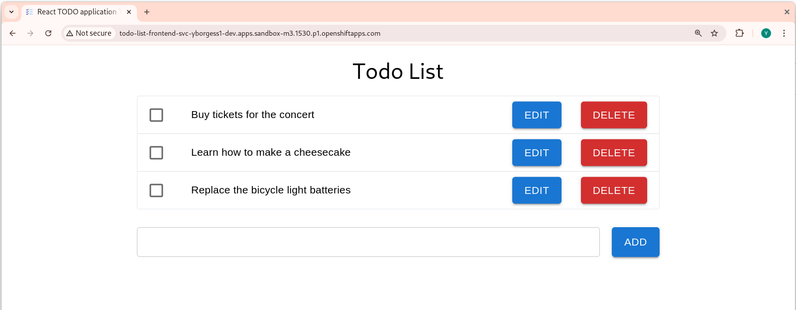

= React Todo List app

A simple Todo List frontend application done with React.

- It is deployed on a https://nginx.org/[nginx] web server
- It expects to consume the API from a backend microservice, see https://github.com/yborgess-pet-projects/spring-boot-todo-list.git[spring-boot-todo-list]
- It can run as a container application of deployed on a container orchestrator, for example on Openshift.

== Requirements
- https://nodejs.org/en/[Node.js] to run it locally
- A container engine, to run it as a container, for example https://podman.io/[podman] or https://www.docker.com/[docker]
- A Kubernetes cluster, for example OpenShift. You can have one online using https://developers.redhat.com/developer-sandbox[Red Hat Developer Sandbox].

== How to run it locally

1. Execute the following
+
[source]
----
$ npm run dev
----
When running locally, it expects a backend API application available at http://localhost:8080.

== How to run it as a container

1. Build the Dokerfile and push the image to your container registry. I use quay.io and podman:
+
[source]
----
$ podman build -t quay.io/yborgess/todo-list-react-frontend .
$ podman push quay.io/yborgess/todo-list-react-frontend:latest
----

2. Launch the frontend application using the compose file:
+
[source]
----
$ ENV_BACKEND_HOST="http://todo-list-app:8080" podman compose -f ./deployment/container/compose.yml
----

3. To stop the frontend application container:

[source]
----
$ podman compose -f ./deployment/container/compose.yml down
----

== How to run it on OpenShift

1. Apply the following resource:
+
[source]
----
$ oc apply -f ./deployment/openshift/deployment.yml
----
+
The frontend deployment resource expects communicate with the backend using a service named `todo-list-backend-svc` available on the same namespace where the frontend application is deployed.

2. Expose the frontend application, so you can access to it from outside the Kubernetes cluster:
+
[source]
----
$ oc expose svc/todo-list-frontend-svc
----

3. Get the host name of the exposed application and open it in a browser:
+
[source]
----
$ echo "http://$(oc get route/todo-list-frontend-svc -o jsonpath='{.spec.host}')"
http://todo-list-frontend-svc-yborgess1-dev.apps.sandbox-m3.1530.p1.openshiftapps.com
----
+

=== Clean up resources

You can delete all the frontend resources using:

[source]
----
$ oc delete all -l tier=frontend
----
